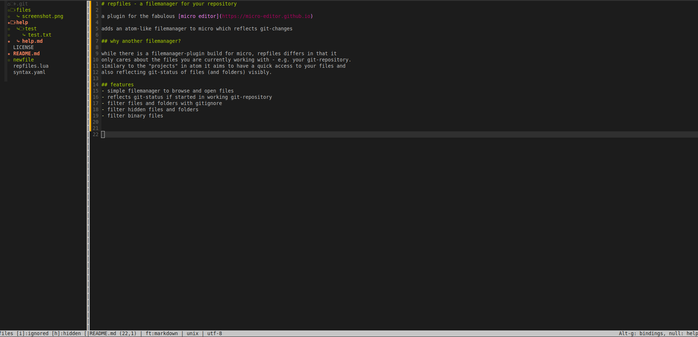

# repfiles - a filemanager for your repository

a plugin for the blazingly fast [micro editor](https://micro-editor.github.io)

adds an atom-like filemanager to micro which reflects git-changes

## why another filemanager?

while there is a filemanager-plugin build for micro, repfiles differs in that it
only cares about the files you are currently working with - e.g. your git-repository.
similary to the "projects" in atom it aims to have a quick access to your files and
also reflecting git-status of files (and folders) visibly.
personaly i have installed both filemanagers but for daily work i prefer repfiles

## how to install

for now go to your micro plugin directory and git clone this repository. for example like this:

```
 cd ~/.config/micro/plug
 git clone https://github.com/gaenseklein/repfiles
```

## features
- simple filemanager to browse and open files
- reflects git-status if started in working git-repository
- filter files and folders with gitignore
- filter hidden files and folders
- filter binary files
- add new files/directorys 
- duplicate files
- move with arrow-keys inside filetree



for more help please look at the [help](help/repfiles.md) page or inside micro `> help repfiles`


have fun coding :)
